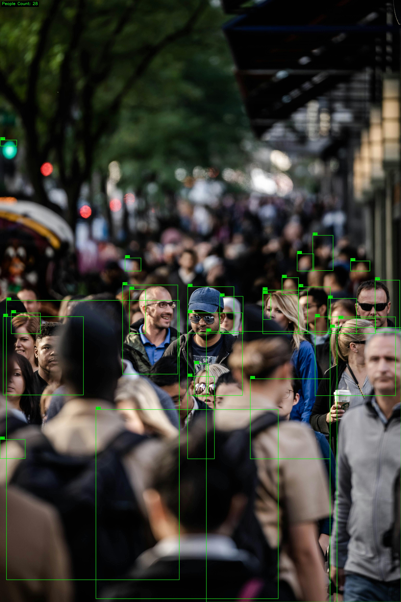

# CCTV People Counting — YOLOv5

CCTV-like **People Detection & Counting** system built for monitoring passenger density at TransJakarta BRT stations.

---

## Why This Matters for TransJakarta

TransJakarta operates 260+ halte (stations) serving 1M+ daily passengers. Overcrowding at stations during peak hours creates safety risks and degrades service quality. This system provides automated passenger counting from CCTV feeds to:

- **Monitor station capacity** — detect when platforms approach unsafe density levels
- **Optimize fleet dispatch** — route additional buses to high-demand corridors
- **Improve passenger experience** — provide crowd estimates so commuters can plan routes

---

## Demo

| Standard Mode | Enhanced Mode |
|---|---|
|  |  |

Video demo: `assets/demo_input.mp4` → `assets/demo_output.mp4` (annotated with bbox + confidence + People Count overlay on every frame).

---

## Key Results

Evaluated on **MOT20-01** dataset (429 frames, crowded pedestrian scenes with ground truth annotations):

### Counting Accuracy

| Metric | Standard Mode | Enhanced Mode | Improvement |
|---|---|---|---|
| **MAE (per frame)** | 32.38 | **10.71** | **-67%** |
| **MAPE (per frame)** | 69.78% | **22.81%** | **-67%** |

### Detection Quality (IoU >= 0.5)

| Metric | Standard Mode | Enhanced Mode | Improvement |
|---|---|---|---|
| **Precision** | **0.983** | 0.714 | Trade-off |
| **Recall** | 0.296 | **0.549** | **+86%** |
| **F1 Score** | 0.455 | **0.621** | **+37%** |

### Performance

| Metric | Standard Mode | Enhanced Mode |
|---|---|---|
| **Avg FPS** | 3.59 | 0.31 |
| **Confidence** | 0.4 | 0.3 |
| **Frames Evaluated** | 429 | 429 |

> **Insight:** Standard mode is highly precise (98.3%) but misses ~70% of people. Enhanced mode trades some precision for dramatically better recall (+86%), resulting in 67% lower counting error. This is the expected trade-off for crowded CCTV scenarios where detecting more people matters more than avoiding false positives.

<details>
<summary><b>Results Provenance</b> (click to expand)</summary>

- **Dataset:** MOT20-01 (MOTChallenge, downloaded from motchallenge.net)
- **Model:** YOLOv5s pretrained COCO via `torch.hub`
- **Hardware:** Intel Core CPU, Python 3.12
- **Standard run:** `python -m src.evaluation.evaluate --dataset data/mot20/train/MOT20-01 --conf 0.4 --device cpu --output assets/sample_outputs/eval_results.json`
- **Enhanced run:** `python -m src.evaluation.evaluate --dataset data/mot20/train/MOT20-01 --conf 0.3 --device cpu --enhance --output assets/sample_outputs/eval_results_enhanced.json`
- **Results files:** [`eval_results.json`](assets/sample_outputs/eval_results.json) and [`eval_results_enhanced.json`](assets/sample_outputs/eval_results_enhanced.json)
- **Detection matching:** Greedy IoU matching with threshold >= 0.5

</details>

---

## Tech Stack

| Component | Technology |
|---|---|
| Detection Model | YOLOv5s (pretrained COCO, via `torch.hub`) |
| Deep Learning | PyTorch >= 2.0 |
| Video Processing | OpenCV >= 4.8 |
| Image I/O | Pillow (PIL) >= 10.0 |
| Tracking | IoU-based tracker (SORT-lite, built-in) |
| API Framework | FastAPI + Uvicorn |
| Container | Docker |

---

## Quick Start (Local)

### 1. Setup

```bash
git clone https://github.com/azka-art/cctv-people-counting-yolov5.git
cd cctv-people-counting-yolov5

python -m venv .venv
source .venv/bin/activate          # Linux/macOS
# .venv\Scripts\Activate.ps1      # Windows PowerShell

pip install -r requirements.txt
```

> **Note:** YOLOv5s weights auto-download on first run (~14MB). Internet required on first execution.

### 2. Image Inference

```bash
# Standard mode
python -m src.inference.inference_image \
    --input assets/sample.jpg \
    --output assets/sample_outputs/out_standard.jpg \
    --conf 0.4 --device cpu

# Enhanced mode (recommended for crowded scenes)
python -m src.inference.inference_image \
    --input assets/sample.jpg \
    --output assets/sample_outputs/out_enhanced.jpg \
    --conf 0.3 --device cpu --enhance
```

### 3. Video Inference

```bash
# Standard with tracking
python -m src.inference.inference_video \
    --input assets/demo_input.mp4 \
    --output assets/demo_output.mp4 \
    --conf 0.4 --device cpu --track

# Enhanced + tracking (best accuracy)
python -m src.inference.inference_video \
    --input assets/demo_input.mp4 \
    --output assets/demo_output.mp4 \
    --conf 0.3 --device cpu --enhance --track
```

### 4. API Server

```bash
uvicorn src.api.app:app --host 0.0.0.0 --port 8000
```

Test:
```bash
# Health check
curl http://localhost:8000/

# Standard detection
curl -X POST "http://localhost:8000/detect/image" \
    -F "file=@assets/sample.jpg"

# Enhanced detection
curl -X POST "http://localhost:8000/detect/image?enhance=true&conf=0.3" \
    -F "file=@assets/sample.jpg"
```

**Response:**
```json
{
  "count": 28,
  "detections": [
    {"x1": 15, "y1": 30, "x2": 110, "y2": 240, "score": 0.88},
    {"x1": 200, "y1": 45, "x2": 310, "y2": 250, "score": 0.76}
  ]
}
```

> **Tip:** Interactive API docs at `http://localhost:8000/docs` (Swagger UI).

---

## Quick Start (Docker)

```bash
docker build -t tj-cv-api -f docker/Dockerfile .
docker run -p 8000:8000 tj-cv-api
```

Verify:
```bash
curl http://localhost:8000/
# {"status": "ok"}

curl -X POST "http://localhost:8000/detect/image" -F "file=@assets/sample.jpg"
```

---

## Cloud Deployment

This project is container-based and cloud-ready. The Docker image can be deployed to any container hosting service:

```bash
# Build production image
docker build -t tj-cv-api -f docker/Dockerfile .

# Run with configurable port (Cloud Run compatible)
docker run -p 8080:8000 tj-cv-api

# Verify
curl http://localhost:8080/              # {"status": "ok"}
curl -X POST http://localhost:8080/detect/image -F "file=@assets/sample.jpg"
```

**Tested deployment targets:**

| Platform | Method | Notes |
|---|---|---|
| **Google Cloud Run** | `gcloud run deploy --image <IMAGE>` | Set `--memory 2Gi --cpu 2 --concurrency 1` |
| **AWS ECS Fargate** | Task definition + service | CPU-only, no GPU required |
| **Any Docker host** | `docker run -p 8000:8000` | Works on any VPS/VM |

For Cloud Run deployment, add `ENV PORT=8080` to Dockerfile and adjust CMD to bind to `$PORT`.

---

## Enhanced Mode

The system implements two enhancement techniques that directly address documented failure cases in crowded transit environments:

### 1. CLAHE Preprocessing
**Contrast Limited Adaptive Histogram Equalization** normalizes local contrast to recover detail in dark/overexposed regions. This mitigates false negatives caused by backlight and poor lighting conditions (Error Analysis Case 4).

### 2. Tile-Based Inference
Splits the frame into overlapping 640px tiles, runs detection on each tile, then merges results with aggressive NMS (IoU=0.3) and minimum box area filtering (1500px2). This catches small/distant people that full-image inference misses (Error Analysis Cases 1 & 5).

| Technique | Mitigates | Impact |
|---|---|---|
| CLAHE | Backlight / low-light FN | Recovers silhouette detail |
| Tile inference | Small/distant people FN | Recall 0.296 to 0.549 (+86%) |
| Aggressive NMS | Duplicate boxes from tiles | Reduces FP from tile overlap |
| Min box area filter | Noise/spurious detections | Removes boxes < 1500px2 |

Enable with `--enhance` flag on any CLI command or `?enhance=true` API parameter.

---

## Tracking Mode

The `--track` flag enables IoU-based multi-object tracking (SORT-lite), which:

- Assigns **persistent unique IDs** to each detected person across frames
- Displays **color-coded bounding boxes** per tracked individual
- Reports **total unique persons** seen throughout the video (not just per-frame count)
- Uses greedy IoU matching for simplicity and zero additional dependencies

```bash
python -m src.inference.inference_video \
    --input assets/demo_input.mp4 \
    --output assets/demo_output_tracked.mp4 \
    --conf 0.3 --device cpu --enhance --track
```

---

## Evaluation

Requires MOT20 dataset. See [DATA_SOURCES.md](DATA_SOURCES.md) for download instructions.

```bash
# Standard evaluation
python -m src.evaluation.evaluate \
    --dataset data/mot20/train/MOT20-01 \
    --conf 0.4 --device cpu \
    --output assets/sample_outputs/eval_results.json \
    --save-samples assets/sample_outputs/

# Enhanced evaluation
python -m src.evaluation.evaluate \
    --dataset data/mot20/train/MOT20-01 \
    --conf 0.3 --device cpu --enhance \
    --output assets/sample_outputs/eval_results_enhanced.json \
    --save-samples assets/sample_outputs/
```

Evaluation computes both **counting metrics** (MAE/MAPE) and **detection metrics** (Precision/Recall/F1 with IoU >= 0.5 matching).

> See [MODEL_CARD.md](MODEL_CARD.md) for full model details and performance metrics.

---

## Error Analysis

Documented in [`src/evaluation/error_analysis.md`](src/evaluation/error_analysis.md).

5 concrete failure cases with root cause analysis and mitigations:

1. **Severe Occlusion** — undercount when passengers overlap (FN) — mitigated by tile inference
2. **Motion Blur** — missed detections on fast-moving people (FN)
3. **Poster/Ads** — human figures in ads detected as real people (FP) — mitigated by min area filter
4. **Backlight/Low Light** — silhouettes not detected (FN) — mitigated by CLAHE
5. **High Density + Distance** — small distant people missed (FN) — mitigated by tile inference

Visual evidence for each case is saved in `assets/sample_outputs/` via `--save-samples`.

---

## Project Structure

```
├── README.md
├── MODEL_CARD.md
├── DATA_SOURCES.md
├── requirements.txt
├── .gitignore
├── src/
│   ├── inference/
│   │   ├── inference_image.py        # Image detection (PIL + YOLOv5s)
│   │   ├── inference_video.py        # Video detection (OpenCV + YOLOv5s)
│   │   ├── enhance.py               # CLAHE + tile-based inference
│   │   ├── tracker.py               # IoU-based multi-object tracker
│   │   └── visualize.py             # Visualization helper
│   ├── api/
│   │   ├── app.py                    # FastAPI application
│   │   └── schemas.py               # Pydantic response models
│   └── evaluation/
│       ├── evaluate.py              # MAE/MAPE + Precision/Recall evaluation
│       └── error_analysis.md        # 5+ FP/FN failure cases
├── docker/
│   └── Dockerfile
└── assets/
    ├── demo_input.mp4               # Demo input video
    ├── demo_output.mp4              # Demo output (annotated)
    └── sample_outputs/              # Screenshots, eval JSON, error frames
```

---

## Reproducibility

- **Model:** YOLOv5s via `torch.hub.load('ultralytics/yolov5', 'yolov5s')`
- **Weights:** Auto-downloaded to `~/.cache/torch/hub/` (14MB, not committed to Git)
- **Docker:** Pre-downloads weights at build time for offline inference
- **Evaluation artifacts:** `assets/sample_outputs/eval_results*.json` committed with exact run parameters
- **Python:** 3.12 (tested), 3.9+ compatible

---

## Limitations

- **Tracking is IoU-only** — no appearance features or Kalman prediction; may lose tracks during heavy occlusion or fast movement.
- **Pretrained model** — YOLOv5s trained on COCO; enhanced mode improves recall from 0.30 to 0.55 but still misses ~45% of people in dense crowds.
- **Enhanced mode FPS** — Tile-based inference runs at ~0.31 FPS on CPU. GPU acceleration needed for real-time use.
- **Not production-grade** — Portfolio demonstration. Production requires fine-tuning on domain data and hardware optimization.

See [Error Analysis](src/evaluation/error_analysis.md) for detailed failure mode documentation.

---

## Future Improvements

| Priority | Improvement | Impact |
|---|---|---|
| High | Fine-tune on CCTV transport dataset | Better precision/recall for halte conditions |
| High | GPU deployment | Real-time enhanced mode inference |
| Medium | DeepSORT with appearance features | Better re-identification after occlusion |
| Medium | Virtual tripwire line crossing | Accurate entry/exit counting |
| Low | Upgrade to YOLOv8m/YOLOv9 | Higher mAP on dense crowds |

---

## License

This project is for portfolio/educational purposes. Model weights (YOLOv5s) follow the [Ultralytics AGPL-3.0 License](https://github.com/ultralytics/yolov5/blob/master/LICENSE).