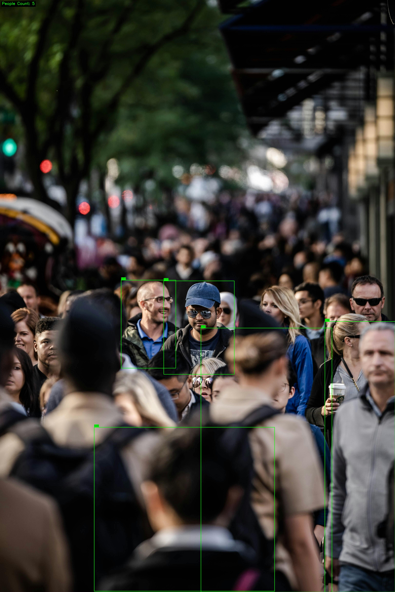
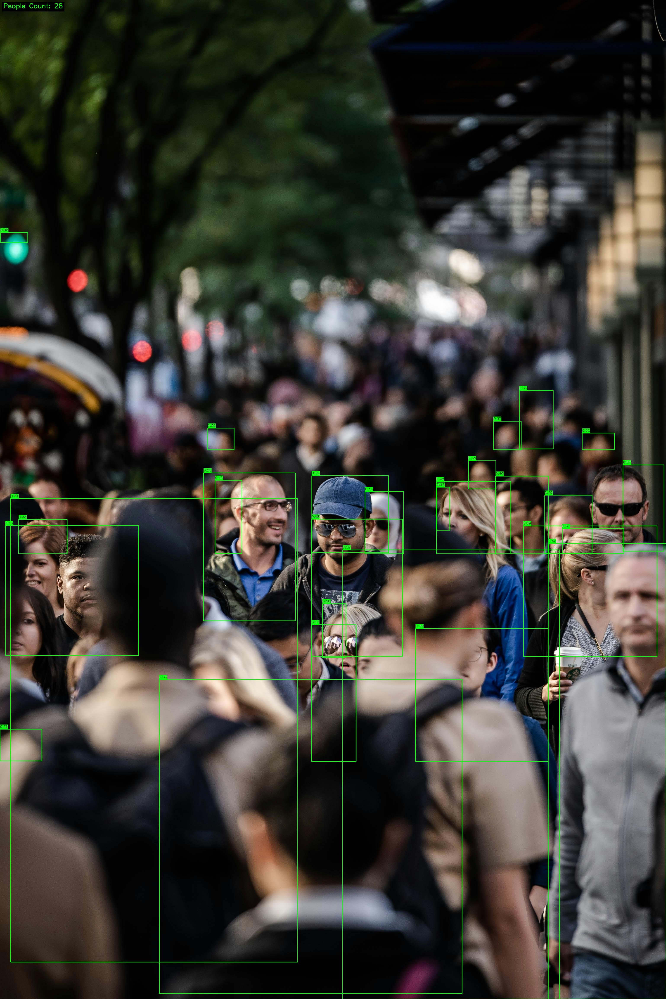

<div align="center">


# 🚌 CCTV People Counting — YOLOv5

**CCTV-like People Detection & Counting for TransJakarta BRT Station Monitoring**

End-to-end computer vision pipeline: YOLOv5s · CLAHE preprocessing · tile-based inference · IoU tracking · FastAPI · Docker

[📦 Quick Start](#quick-start-local) · [📊 Results](#key-results) · [🐳 Docker](#quick-start-docker) · [🔍 Error Analysis](src/evaluation/error_analysis.md) · [📋 Model Card](MODEL_CARD.md)

</div>

---

## Why This Matters for TransJakarta

TransJakarta serves over **1 million daily trips** across hundreds of BRT shelters (halte) throughout Jakarta ([~1.4 million trips/day, ANTARA 2026](https://www.antaranews.com/berita/5361222/transjakarta-akui-ada-gap-antara-jumlah-penumpang-dan-infrastruktur)). Overcrowding at stations during peak hours creates safety risks and degrades service quality. This system provides automated passenger counting from CCTV feeds to:

- 🔴 **Monitor station capacity** — detect when platforms approach unsafe density levels
- 🚍 **Optimize fleet dispatch** — route additional buses to high-demand corridors
- 📱 **Improve passenger experience** — provide crowd estimates so commuters can plan routes

---

## Demo

> 📹 **[Watch demo video on YouTube ↗](https://youtu.be/YOUR_VIDEO_LINK)** *(replace with your link)*

| Standard Mode | Enhanced Mode |
|---|---|
|  |  |
| Conf: 0.4 · Precision: 0.983 · Recall: 0.296 | Conf: 0.3 · CLAHE + Tile · Recall: 0.549 |

---

## Key Results

Evaluated on **MOT20-01** (429 frames, crowded pedestrian scenes, MOTChallenge ground truth):

### Counting Accuracy

| Metric | Standard Mode | Enhanced Mode | Δ |
|---|---|---|---|
| **MAE (per frame)** | 32.38 | **10.71** | ↓ 67% |
| **MAPE (per frame)** | 69.78% | **22.81%** | ↓ 67% |

### Detection Quality (IoU ≥ 0.5)

| Metric | Standard Mode | Enhanced Mode | Δ |
|---|---|---|---|
| **Precision** | **0.983** | 0.714 | trade-off |
| **Recall** | 0.296 | **0.549** | ↑ 86% |
| **F1 Score** | 0.455 | **0.621** | ↑ 37% |

### Throughput

| Mode | Avg FPS | Confidence | Frames |
|---|---|---|---|
| Standard | 3.59 | 0.4 | 429 |
| Enhanced | 0.31 | 0.3 | 429 |

> **Design choice:** Standard mode is highly precise (98.3%) but misses ~70% of people in dense crowds. Enhanced mode trades some precision for dramatically better recall (+86%), yielding 67% lower counting error — the right trade-off for crowded BRT station monitoring where missing a person is more costly than a rare false positive.

<details>
<summary>📂 Results Provenance (click to expand)</summary>

- **Dataset:** MOT20-01 (MOTChallenge, downloaded from motchallenge.net)
- **Model:** YOLOv5s pretrained COCO via `torch.hub`
- **Hardware:** Intel Core CPU, Python 3.12
- **Standard run:**
  ```bash
  python -m src.evaluation.evaluate --dataset data/mot20/train/MOT20-01 \
    --conf 0.4 --device cpu --output assets/sample_outputs/eval_results.json
  ```
- **Enhanced run:**
  ```bash
  python -m src.evaluation.evaluate --dataset data/mot20/train/MOT20-01 \
    --conf 0.3 --device cpu --enhance --output assets/sample_outputs/eval_results_enhanced.json
  ```
- **Artifact files:** [`eval_results.json`](assets/sample_outputs/eval_results.json) · [`eval_results_enhanced.json`](assets/sample_outputs/eval_results_enhanced.json)
- **Detection matching:** Greedy IoU matching, threshold ≥ 0.5

</details>

---

## Tech Stack

| Layer | Technology |
|---|---|
| Detection Model | YOLOv5s (pretrained COCO, via `torch.hub`) |
| Deep Learning | PyTorch ≥ 2.0 |
| Video I/O | OpenCV ≥ 4.8 |
| Image Preprocessing | Pillow (PIL) ≥ 10.0 · CLAHE (OpenCV) |
| Tracking | IoU-based association with persistent ID assignment |
| API Framework | FastAPI + Uvicorn |
| Container | Docker |

---

## Quick Start (Local)

### 1. Setup

```bash
git clone https://github.com/azka-art/cctv-people-counting-yolov5.git
cd cctv-people-counting-yolov5

python -m venv .venv
source .venv/bin/activate          # Linux/macOS
# .venv\Scripts\Activate.ps1      # Windows PowerShell

pip install -r requirements.txt
```

> **Note:** YOLOv5s weights (~14MB) auto-download on first run via `torch.hub`. Internet required for first execution only.

---

### 2. Image Inference

```bash
# Standard mode
python -m src.inference.inference_image \
    --input assets/sample.jpg \
    --output assets/sample_outputs/out_standard.jpg \
    --conf 0.4 --device cpu

# Enhanced mode — recommended for crowded/backlit scenes
python -m src.inference.inference_image \
    --input assets/sample.jpg \
    --output assets/sample_outputs/out_enhanced.jpg \
    --conf 0.3 --device cpu --enhance
```

**Expected output:** Annotated image with bounding boxes, confidence scores, and `People Count: N` overlay.

---

### 3. Video Inference

```bash
# Standard with tracking
python -m src.inference.inference_video \
    --input assets/demo_input.mp4 \
    --output assets/demo_output.mp4 \
    --conf 0.4 --device cpu --track

# Enhanced + tracking — best accuracy for dense crowds
python -m src.inference.inference_video \
    --input assets/demo_input.mp4 \
    --output assets/demo_output.mp4 \
    --conf 0.3 --device cpu --enhance --track
```

**Expected output:** `assets/demo_output.mp4` — annotated video at original FPS and resolution with bbox + confidence + People Count overlay per frame.

---

### 4. API Server

```bash
uvicorn src.api.app:app --host 0.0.0.0 --port 8000
```

```bash
# Health check
curl http://localhost:8000/
# → {"status": "ok"}

# Standard detection
curl -X POST "http://localhost:8000/detect/image" \
    -F "file=@assets/sample.jpg"

# Enhanced detection (crowded scenes)
curl -X POST "http://localhost:8000/detect/image?enhance=true&conf=0.3" \
    -F "file=@assets/sample.jpg"
```

**Response contract:**

```json
{
  "count": 28,
  "detections": [
    {"x1": 15, "y1": 30, "x2": 110, "y2": 240, "score": 0.88},
    {"x1": 200, "y1": 45, "x2": 310, "y2": 250, "score": 0.76}
  ]
}
```

> `count` = number of detected persons after NMS and person-class filter at the given confidence threshold (per-image, not tracked across frames). Coordinates are in pixels relative to input resolution.

> 💡 Interactive API docs at `http://localhost:8000/docs` (Swagger UI)

---

## Quick Start (Docker)

```bash
docker build -t tj-cv-api -f docker/Dockerfile .
docker run -p 8000:8000 tj-cv-api
```

```bash
# Verify
curl http://localhost:8000/
# → {"status": "ok"}

curl -X POST "http://localhost:8000/detect/image" \
    -F "file=@assets/sample.jpg"
```

---

## Cloud Deployment

The Docker image deploys to any container hosting service:

| Platform | Command |
|---|---|
| **Google Cloud Run** | `gcloud run deploy --image <IMAGE> --port 8000` |
| **AWS ECS Fargate** | Task definition + service (CPU-only, no GPU required) |
| **Any Docker host** | `docker run -p 8000:8000 tj-cv-api` |

> **Cloud Run note:** Container binds to port 8000. Use `--port 8000` in `gcloud run deploy`, or modify Dockerfile CMD to bind to `$PORT` for native Cloud Run compatibility.

---

## Enhanced Mode — How It Works

Two techniques address the documented failure modes in crowded transit environments:

### 1. CLAHE Preprocessing

**Contrast Limited Adaptive Histogram Equalization** normalizes local contrast to recover detail in dark and overexposed regions — directly mitigating false negatives from backlight and poor lighting (see [Error Analysis Case 4](src/evaluation/error_analysis.md)).

### 2. Tile-Based Inference

Splits each frame into overlapping 640px tiles, runs detection on each tile independently, then merges results with aggressive NMS (IoU=0.3) and minimum box area filtering (1500px²) — catching small and distant people that full-image inference misses (see [Error Analysis Cases 1 & 5](src/evaluation/error_analysis.md)).

| Technique | Failure Mode Addressed | Measured Impact |
|---|---|---|
| CLAHE | Backlight / low-light FN | Recovers silhouette detail |
| Tile inference | Small/distant people FN | Recall 0.296 → 0.549 (+86%) |
| Aggressive NMS | Duplicate boxes from tile overlap | Reduces FP from tile merging |
| Min box area filter | Noise/spurious detections | Removes boxes < 1500px² |

Enable with `--enhance` on any CLI command or `?enhance=true` on the API.

---

## Tracking Mode

The `--track` flag enables IoU-based multi-object tracking with persistent ID assignment across frames:

- Assigns **unique IDs** to each detected person across frames
- Displays **color-coded bounding boxes** per tracked individual
- Reports **total unique persons** seen throughout the video (not just per-frame count)
- Zero additional dependencies — uses greedy IoU association

```bash
python -m src.inference.inference_video \
    --input assets/demo_input.mp4 \
    --output assets/demo_output_tracked.mp4 \
    --conf 0.3 --device cpu --enhance --track
```

> **Note:** Unique total is approximate. Tracks may be lost during heavy occlusion and re-initialized as new IDs. For production use cases requiring robust re-identification, consider upgrading to DeepSORT or ByteTrack (see [Future Improvements](#future-improvements)).

---

## Evaluation

Requires MOT20 dataset. See [DATA_SOURCES.md](DATA_SOURCES.md) for download instructions.

```bash
# Standard evaluation
python -m src.evaluation.evaluate \
    --dataset data/mot20/train/MOT20-01 \
    --conf 0.4 --device cpu \
    --output assets/sample_outputs/eval_results.json \
    --save-samples assets/sample_outputs/

# Enhanced evaluation
python -m src.evaluation.evaluate \
    --dataset data/mot20/train/MOT20-01 \
    --conf 0.3 --device cpu --enhance \
    --output assets/sample_outputs/eval_results_enhanced.json \
    --save-samples assets/sample_outputs/
```

Evaluation computes **counting metrics** (MAE/MAPE) and **detection metrics** (Precision/Recall/F1 at IoU ≥ 0.5). Frames with `|error| > 2` are flagged and saved to `--save-samples` for error analysis.

> See [MODEL_CARD.md](MODEL_CARD.md) for full model details and performance metrics.

---

## Error Analysis

Documented in [`src/evaluation/error_analysis.md`](src/evaluation/error_analysis.md) — 5 concrete failure cases with visual evidence, root cause analysis, and mitigations:

| # | Type | Condition | Error | Mitigation |
|---|---|---|---|---|
| 1 | **False Negative** | Severe occlusion (>70% body covered) | −4 per frame | Tile inference |
| 2 | **False Negative** | Motion blur (≥ 2 m/s) | −2 per frame | Temporal averaging |
| 3 | **False Positive** | Human figures in ads/posters | +2 per frame | ROI masking, min area filter |
| 4 | **False Negative** | Backlight / low illumination | −5 per frame | CLAHE preprocessing |
| 5 | **False Negative** | High density + bird-eye distance | −11 per frame | Tile inference |

Visual evidence for each case is saved in `assets/sample_outputs/` via `--save-samples`.

---

## Project Structure

```
cctv-people-counting-yolov5/
├── README.md
├── MODEL_CARD.md               # Model details, metrics, ethical considerations
├── DATA_SOURCES.md             # Dataset provenance and download instructions
├── requirements.txt
├── .gitignore
├── src/
│   ├── inference/
│   │   ├── inference_image.py  # Image detection (PIL + YOLOv5s)
│   │   ├── inference_video.py  # Video detection (OpenCV + YOLOv5s)
│   │   ├── enhance.py          # CLAHE + tile-based inference
│   │   ├── tracker.py          # IoU-based multi-object tracker
│   │   └── visualize.py        # Visualization utilities
│   ├── api/
│   │   ├── app.py              # FastAPI application
│   │   └── schemas.py          # Pydantic response models
│   └── evaluation/
│       ├── evaluate.py         # MAE/MAPE + Precision/Recall/F1 evaluation
│       └── error_analysis.md   # 5 FP/FN failure cases with mitigations
├── docker/
│   └── Dockerfile
└── assets/
    ├── demo_input.mp4          # Demo input video
    ├── demo_output.mp4         # Demo output (annotated)
    └── sample_outputs/         # Screenshots, eval JSON, flagged error frames
```

---

## Limitations

- **Tracking is IoU-only** — no appearance features or Kalman prediction; may lose tracks during heavy occlusion or fast movement.
- **Pretrained model** — YOLOv5s trained on COCO; enhanced mode improves recall from 0.30 to 0.55 but still misses ~45% of people in the densest crowd conditions.
- **Enhanced mode FPS** — Tile-based inference runs at ~0.31 FPS on CPU. GPU acceleration required for real-time use.
- **Not production-grade** — Portfolio demonstration. Production deployment requires fine-tuning on domain-specific CCTV data and hardware optimization.

---

## Future Improvements

| Priority | Improvement | Expected Impact |
|---|---|---|
| 🔴 High | Fine-tune on CCTV transport dataset | Better precision/recall for halte conditions |
| 🔴 High | GPU deployment (ONNX/TensorRT export) | Real-time enhanced mode inference |
| 🟡 Medium | DeepSORT / ByteTrack with appearance features | Robust re-ID after occlusion, reduced ID switches |
| 🟡 Medium | Virtual tripwire / line crossing counter | Accurate entry/exit counting per gate |
| 🟢 Low | Upgrade to YOLOv8m or YOLOv9 | Higher mAP on dense crowds |

---

## Reproducibility

- **Model weights:** YOLOv5s auto-downloaded via `torch.hub.load('ultralytics/yolov5', 'yolov5s')` — not committed to Git
- **Docker:** Weights pre-downloaded at build time for offline inference
- **Evaluation artifacts:** `assets/sample_outputs/eval_results*.json` committed with exact run parameters
- **Python:** 3.12 (tested), 3.9+ compatible

---

## License

This project is for portfolio and educational purposes. It uses [Ultralytics YOLOv5](https://github.com/ultralytics/yolov5) under the [AGPL-3.0 License](https://github.com/ultralytics/yolov5/blob/master/LICENSE). Deploying as a network service requires AGPL-3.0 compliance or Ultralytics Enterprise licensing.

---

<div align="center">

Built with ❤️ for All Public Transport Enthusiast · Jakarta, Indonesia

</div>